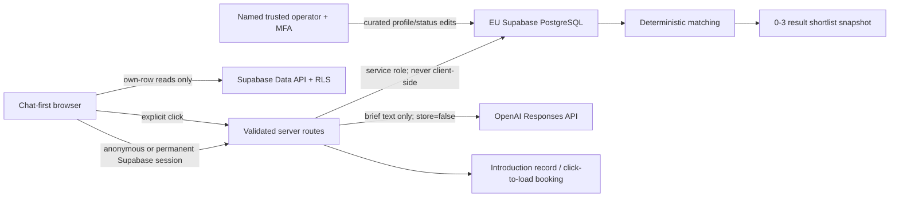

# Freelancer V1 data model and security boundary

## Decision summary

V1 uses one managed Supabase project in a client-approved EU region. Supabase
Auth provides anonymous, Google, Microsoft and email identities; PostgreSQL is
the application store; Supabase Studio/Table Editor is the operator interface.
There is no custom admin application and no payment functionality in this
version.

The EU region is an infrastructure setting, not a SQL setting. Acceptance
evidence must therefore include the Supabase project reference, selected EU
region, plan, DPA/subprocessor record and a screenshot or exported project
setting. This migration must not be applied to a project whose region has not
been approved.

## Boundaries and data flow



Freelancer profiles are never sent to OpenAI for scoring, ranking, selection or
inferred suitability. OpenAI may turn the user's request into a schema-validated
brief. Matching uses only application code/SQL and curated profile facts.

No raw IP address is stored. Server routes derive rotating HMAC values for IP
and user subjects before calling the quota RPCs. Chat bodies, identity tokens,
secrets and complete Calendly payloads must not enter `audit_events` or server
logs.

## Table catalogue

| Table | Purpose | Browser access | Write authority |
|---|---|---|---|
| `user_profiles` | Display preference linked to `auth.users` | Own row | User may create/update display name and locale; server otherwise |
| `projects` | Original request, structured brief and project lifecycle | Own rows, read-only | Validated server routes |
| `messages` | Minimal reconstructable conversation state | Own rows, read-only | Validated server routes |
| `freelancer_profiles` | Curated public-safe provider catalogue | None; server releases only owned shortlist snapshots | Supabase Studio or service route |
| `shortlists` | One deterministic search run, including zero results | Own rows, read-only | Matching service only |
| `matches` | Up to three candidate snapshots beneath a shortlist | Own rows, read-only | Matching service only |
| `intro_bookings` | Explicit introduction request and minimal booking state | Own rows, read-only | Introduction service or Studio |
| `engagements` | Post-introduction commercial lifecycle | Own rows, read-only | Studio/service after explicit confirmation |
| `engagement_status_events` | Append-style visible engagement status history | Own rows, read-only | Database trigger |
| `audit_events` | Redacted security/business trace | None | Service/trigger insert; controlled actor anonymization only |
| `ai_usage_buckets` | Minute/day/month counters | None | Quota RPCs through service role |
| `ai_usage_reservations` | Idempotent estimate-to-actual reconciliation | None | Quota RPCs through service role |
| `guest_claims` | Hashed, expiring one-time workspace claims | None | Guest-claim service route/RPC |
| `retention_policies` | Operator-configurable retention rules | None | Supabase Studio/service role |

Every public table has RLS enabled and forced. All Data API grants are explicit.
The unauthenticated PostgreSQL `anon` role has no table access. A product guest
first calls Supabase anonymous sign-in and therefore receives a unique
`auth.uid()` under the `authenticated` role.

## Structured brief contract

`projects.structured_brief` is an object produced and validated by the server.
The V1 schema version is `freelancer-brief-v1` and contains:

- `project_title`
- `summary`
- `required_skills`
- `optional_skills`
- `language`
- `work_mode` (`remote`, `on_site`, `hybrid` or `unknown`)
- `location`
- `start_window`
- `duration`
- `budget_or_rate`
- `constraints`

Unknown input remains `null`/`unknown`; it is never invented. The original text
is always retained in `projects.original_request`, including when the provider
times out or a cost cap blocks AI use. `brief_status='failed'` or `manual` keeps
the fallback path reconstructable.

Profile language arrays use normalized lowercase codes (`de`, `en`, `es`), while
the brief/UI may use canonical labels (`German`, `English`, `Spanish`). The
server mapper owns this explicit label-to-code conversion before matching; SQL
must never compare an unnormalized display label directly.

## Deterministic matching rule (`deterministic-v1`)

Eligibility is a hard filter, evaluated before ordering:

1. `profile_status = 'active'` and `availability_status = 'available'`.
2. Every required skill is present in normalized `skill_tags`.
3. A requested language is present in `languages`.
4. The requested work mode is present in `work_modes`; an on-site location must
   pass the documented exact/normalized location rule in the server.
5. The availability date satisfies the supplied start window.
6. A supplied rate/budget ceiling is respected; an absent commercial value is
   not invented.

Eligible rows are ordered by this visible, stable rule:

1. Count of explicitly requested optional skills, descending.
2. Earliest known `availability_from`, unknown last.
3. Most recently confirmed `availability_updated_at`, descending.
4. UUID ascending as the final stable tie-breaker.

The first three rows are returned. There is no hidden score and no automated
hiring decision. Each result stores reasons, known gaps, verified facts,
self-reported facts, the complete public-safe profile snapshot, profile version
and matching-rule version. The customer chooses a profile.

Every run first creates `shortlists`, even when `result_count = 0`. A zero-result
record therefore preserves the brief, rule and catalogue version without
fabricating a candidate. `profile_catalog_version` is a deterministic SHA-256
marker computed server-side from the ordered eligible public-safe profile IDs
and versions (for example, hash of `id:version` lines sorted by ID). Matches are
inserted in the same transaction and their count must equal `result_count`.

## Profile facts and operator states

`verified_facts` contains only facts supported by the operator's approved
evidence. `self_reported_facts` contains claims supplied by the freelancer.
`verification_status` summarizes the completed operator process; it does not
turn self-reported content into verified content.

Only the following combination is eligible:

```text
profile_status = active AND availability_status = available
```

`paused`, `unavailable`, `archived`, `limited`, `unknown` and unavailable rows
are excluded immediately. `version` increments on every profile update and the
availability timestamp refreshes when status or availability changes.

`intro_policy` is either `free` or `manual_approval`. “Manual approval” is the
V1 treatment for premium profiles; it is not a payment state. No Stripe, bank
transfer, charge, invoice, fee or payment table/field exists.

## Explicit actions and idempotency

An introduction is created only after a server route receives an explicit
customer click. The row requires `explicit_confirmation_at` and a client/server
idempotency key unique per owner. Replaying the same click returns the existing
record. Calendly or other third-party content stays click-to-load; only the
minimal provider, URL and booking reference are stored.

An engagement row requires `confirmation_source` and `confirmed_at`; model
output cannot create it. Statuses are `proposed`, `accepted`, `active`,
`completed`, `cancelled` and `disputed`. A trigger records every initial/current
status in `engagement_status_events`.

## Guest identity and account conversion

Anonymous sign-in is the primary guest identity; IP is never an ownership key.
If Google/Microsoft/email is linked to the same anonymous user, the `auth.uid()`
and ownership rows stay unchanged. If the person signs into an already-existing
account, a server route creates a short-lived random token, stores only its
SHA-256 hash in `guest_claims`, validates both sessions and invokes:

```sql
public.claim_guest_workspace(p_token_hash text, p_target_user_id uuid)
```

The service-only, security-invoker RPC locks and consumes the claim, transfers
projects and dependent ownership atomically, and writes a redacted audit event.
It returns `false` for an expired, consumed or unknown token. Raw claim tokens,
identity tokens and user metadata are never used as authorization data.

## AI quota contracts

Only server routes may execute either RPC:

```text
consume_ai_quota(
  p_request_key text,
  p_user_hash text,
  p_ip_hash text,
  p_is_anonymous boolean,
  p_request_limit integer,
  p_daily_token_limit bigint,
  p_monthly_budget_cents bigint,
  p_estimated_tokens bigint,
  p_estimated_cost_cents bigint
) -> allowed, reason, retry_after, reservation_id

record_ai_usage(
  p_request_key text,
  p_actual_input_tokens bigint,
  p_actual_output_tokens bigint,
  p_actual_cost_cents bigint,
  p_outcome text
) -> recorded, reason
```

`consume_ai_quota` atomically checks user and IP minute limits, user daily token
limits, anonymous-IP daily token limits and the provider monthly cost cap. It
reserves estimated tokens/cost under a stable request key. `record_ai_usage`
reconciles that reservation exactly once with actual provider usage. Failed or
timed-out calls must also be reconciled; stale reservations fail closed until an
operator-approved server job records their final outcome.

A repeated request key returns `allowed=false`, `reason='already_reserved'` and
the existing reservation ID. The server must resume/replay its own stored result;
it must not issue a second provider call.

The server derives `p_user_hash` and `p_ip_hash` with HMAC-SHA-256 using a
rotatable server secret. Plain auth IDs and IP addresses are not accepted into
these tables. The `provider:openai` month bucket is the configurable hard stop;
alerting should trigger before the cap in application monitoring.

## Deletion and retention

All user-owned application foreign keys cascade from `auth.users`. Audit actor
references use `ON DELETE SET NULL`. Before calling
`auth.admin.deleteUser()` server-side, call the service-only function:

```sql
public.prepare_user_deletion(p_user_id uuid) -> actor_tombstone text
```

It replaces user-linked audit actors with a random tombstone and records the
preparation event without chat, identity or token content. Deleting the Auth
user then removes owned app rows and leaves only the pseudonymous audit trace.

`retention_policies` contains the controller-configurable defaults used by
`run_retention_cleanup()`. Supabase Cron invokes the function daily at 02:25
UTC. Only `hard_delete` and the approved audit expiry are automated;
`operator_review` rows are never deleted by the job. Changing a retention row
affects the next run, so every production change requires the operator review
and evidence procedure.

## Supabase Studio caveat

V1 intentionally uses Studio instead of a custom admin. A Supabase project
Developer/Administrator can have broader project visibility than the business
task “edit freelancer profiles”. Therefore Studio access is limited to named,
trusted internal operators with MFA, separate accounts and a written runbook.
Do not invite external freelancers or customers into the Supabase project.

## Verification artefacts

- Migration: `supabase/migrations/20260806103000_freelancer_v1.sql`
- Security/retention hardening: `supabase/migrations/20260806130000_v1_security_hardening.sql`
- Booking-URL scrub: `supabase/migrations/20260806133000_scrub_match_booking_urls.sql`
- Synthetic seed: `supabase/seed.sql`
- Cross-user/negative tests: `supabase/tests/database/rls_isolation.test.sql`
- Query-plan evidence: `supabase/tests/database/query_plan_evidence.sql`
- Operator procedure: `docs/operator-runbook.md`

Run these on an isolated local/staging Supabase instance before any production
application. Capture the migration list, test output, query plans, database
security/performance advisor output, backup configuration and one restore test
as handover evidence.
