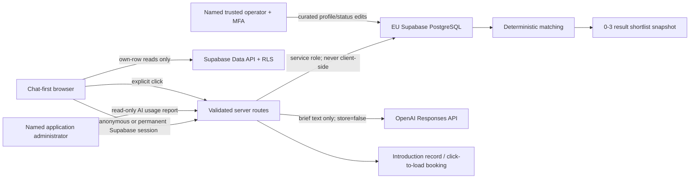
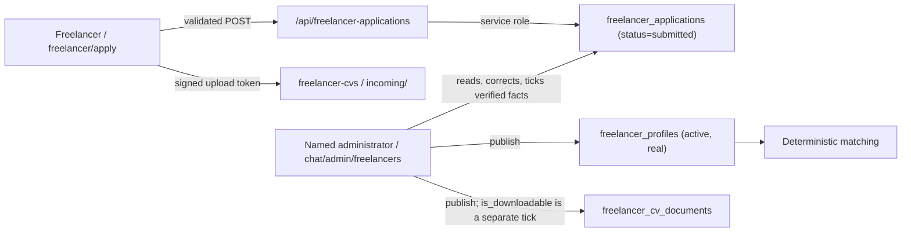

# Freelancer V1 data model and security boundary

## Decision summary

V1 uses one managed Supabase project in a client-approved EU region. Supabase
Auth provides anonymous, Google, Microsoft and email identities; PostgreSQL is
the application store; Supabase Studio/Table Editor remains the profile
operator interface. A narrow, protected application page reports AI usage and
internal credit balances; it is not a general profile/customer admin. There is
no payment functionality in this version.

The EU region is an infrastructure setting, not a SQL setting. Acceptance
evidence must therefore include the Supabase project reference, selected EU
region, plan, DPA/subprocessor record and a screenshot or exported project
setting. This migration must not be applied to a project whose region has not
been approved.

## Boundaries and data flow



Freelancer profiles are never sent to OpenAI for scoring, ranking, selection or
inferred suitability. OpenAI may turn the user's request into a schema-validated
brief. Matching uses only application code/SQL and curated profile facts.

No raw IP address is stored. Server routes derive rotating HMAC values for IP
and user subjects before calling the quota RPCs. Chat bodies, identity tokens,
secrets and complete Calendly payloads must not enter `audit_events` or server
logs.

## Table catalogue

| Table | Purpose | Browser access | Write authority |
|---|---|---|---|
| `user_profiles` | Display preference linked to `auth.users` | Own row | User may create/update display name and locale; server otherwise |
| `projects` | Original request, structured brief and project lifecycle | Own rows, read-only | Validated server routes |
| `project_collections` | User-created folders that group multiple chat/project rows | Own rows, read-only | Validated server routes |
| `messages` | Minimal reconstructable conversation state | Own rows, read-only | Validated server routes |
| `freelancer_profiles` | Curated public-safe provider catalogue | None; server releases only owned shortlist snapshots | Supabase Studio or service route |
| `freelancer_cv_documents` | Service-only metadata for private PDF CV objects | None | Controlled operator/service-role workflow only |
| `freelancer_applications` | Self-registered freelancer claims waiting for operator verification | None | Public application route inserts; admin review route decides. Both through the service role |
| `shortlists` | One deterministic search run, including zero results | Own rows, read-only | Matching service only |
| `matches` | Up to three candidate snapshots beneath a shortlist | Own rows, read-only | Matching service only |
| `intro_bookings` | Explicit introduction request and minimal booking state | Own rows, read-only | Introduction service or Studio |
| `engagements` | Post-introduction commercial lifecycle | Own rows, read-only | Studio/service after explicit confirmation |
| `engagement_status_events` | Append-style visible engagement status history | Own rows, read-only | Database trigger |
| `audit_events` | Redacted security/business trace | None | Service/trigger insert; controlled actor anonymization only |
| `ai_usage_buckets` | Minute/day/month counters | None | Quota RPCs through service role |
| `ai_usage_reservations` | Canonical idempotent request ledger with estimated and actual provider usage/cost/credits | None | Quota RPCs through service role |
| `ai_usage_events` | Service-only settled-usage view over `ai_usage_reservations`; not a second ledger | None | Read-only service-role view |
| `user_ai_credit_accounts` | Internal XPORTAL-credit allocation, used and reserved balances | None | Credit/quota RPCs through service role; approved Studio adjustment only |
| `guest_claims` | Hashed, expiring one-time workspace claims | None | Guest-claim service route/RPC |
| `retention_policies` | Operator-configurable retention rules | None | Supabase Studio/service role |

Every public table has RLS enabled and forced. All Data API grants are explicit.
The unauthenticated PostgreSQL `anon` role has no table access. A product guest
first calls Supabase anonymous sign-in and therefore receives a unique
`auth.uid()` under the `authenticated` role.

Freelancer CV files live only in the private `freelancer-cvs` Storage bucket.
There is deliberately no browser Storage policy. A permanent account can ask
the server for a 60-second signed download only when the exact profile is a
primary or alternative recommendation in the latest persisted ranked shortlist
of an owned, non-pending project. The server checks live object MIME type, size
and a maximum 60-second object cache TTL before signing. Anonymous accounts,
partial matches and legacy/unclassified snapshots fail closed without exposing
document existence.

## Freelancer self-registration and verification

`freelancer_applications` is a staging table, never a second catalogue. A
freelancer fills in `/freelancer/apply`; the row lands with
`status='submitted'` and is invisible to the product. Matching reads
`freelancer_profiles` only, so nothing an applicant types can reach a customer
before a named administrator publishes it.



Rules the publish path enforces:

- **Claims stay claims.** Every submitted statement is written as a
  `self_reported_facts` entry. A statement moves to `verified_facts` only when
  the reviewer ticks it individually in the review screen.
- **A published profile must be reachable.** `fetchActiveBookableRealProfiles`
  filters on `profile_status='active'`, `demo_status='real'`, a non-null HTTPS
  `booking_url` and an availability other than `unavailable`. Publishing
  therefore refuses a missing booking URL rather than creating a row that can
  never appear in a shortlist.
- **One decision per application.** `published_profile_id` is set in the same
  update that sets `status='approved'`, and the insert is rolled back if that
  update fails, so a live catalogue row never exists without its provenance
  record.
- **CVs never enter the database.** The file is uploaded straight to the private
  `freelancer-cvs` bucket with a short-lived signed token under an `incoming/`
  prefix; the row keeps only the object key, and reviewers open it through a
  two-minute signed URL. On approval the object is re-uploaded as the profile's
  `<profile-uuid>/cv-v1.pdf` with the `application/pdf` content type and the
  `max-age=60` the download route verifies, a `freelancer_cv_documents` row is
  written, and the staging copy is removed. `is_downloadable` stays a separate
  reviewer decision and defaults to false: consent to be reviewed is not consent
  to be shown to customers. A failed handover keeps the staging copy and is
  reported to the reviewer instead of rolling back an otherwise correct profile.

## Structured brief contract

`projects.structured_brief` is an object produced and validated by the server.
The V1 schema version is `freelancer-brief-v1` and contains:

- `project_title`
- `summary`
- `required_skills`
- `optional_skills`
- `language`
- `work_mode` (`remote`, `on_site`, `hybrid` or `unknown`)
- `location`
- `start_window`
- `duration`
- `budget_or_rate`
- `constraints`

Unknown input remains `null`/`unknown`; it is never invented. The original text
is always retained in `projects.original_request`, including when the provider
times out or a cost cap blocks AI use. `brief_status='failed'` or `manual` keeps
the fallback path reconstructable.

Profile language arrays use normalized lowercase codes (`de`, `en`, `es`), while
the brief/UI may use canonical labels (`German`, `English`, `Spanish`). The
server mapper owns this explicit label-to-code conversion before matching; SQL
must never compare an unnormalized display label directly.

## Deterministic matching rule (`freelancer-match-v8`)

Eligibility is a hard filter, evaluated before ordering:

1. `profile_status = 'active'`, `demo_status = 'real'`, a valid HTTPS
   `booking_url` is present, and availability is not `unavailable`.
2. At least one meaningful requested skill is present in normalized
   `skill_tags`, either exactly or through the reviewed taxonomy below. This is
   the relevance floor that prevents an unrelated profile from appearing.
   Further requested skills without profile evidence remain visible as known
   gaps, so a relevant near match is not silently discarded.
3. A requirement becomes a categorical hard filter only when the user's
   original text marks it with `MUSS`, `must`, `zwingend`,
   `Ausschlusskriterium` or `knock-out`. Known conflicts in language, work mode,
   on-site location or start availability then exclude the row. An absent or
   unconfirmed profile fact is shown as a gap rather than treated as proof that
   the freelancer lacks it.
4. Technology entries under `Soll-Anforderungen`, `optional`, `bevorzugt`,
   `preferred` or `nice-to-have` headings are reclassified as optional even if
   an upstream extraction placed them in `required_skills`. Long preferred
   technology lists therefore affect ordering, not eligibility.
5. Missing qualification, contractual and generic constraint evidence remains
   visible. Requested delivery capacity (for example, `100% Auslastung`) is an
   engagement detail and is disclosed for the introductory call. Residency is
   never inferred from a current location.
6. A rate or budget constraint applies only when at least one amount from the
   structured range is also present in a commercial context in
   `original_request` (currency, budget/rate wording and the requested rate
   unit where applicable). A confirmed profile value outside that explicitly
   supplied range is excluded; an unknown value remains a gap. No default or
   hidden EUR 800 threshold exists.

Reviewed skill families cover spelling and terminology variants, not inferred
competence. They include requirements/process/project/security families;
SAP S/4HANA, MM, PP, integration and customizing; and the AI-property-copilot
families software/AI architecture, Azure AI, Microsoft Copilot, AI projects,
document analysis, RAG, Microsoft 365, enterprise applications, business
process automation, Python, FastAPI and PostgreSQL. Adding a broader alias
requires an operator review because it changes shortlist behavior.

Eligible rows are ordered by this visible, stable rule:

1. Exact match of the first named core skill before profiles matching
   only secondary or generic skills.
2. Count of all core-skill matches (exact or reviewed alias), descending.
3. Count of exact core-skill matches, descending.
4. Confirmed commercial compatibility before unknown compatibility when the
   user explicitly supplied a rate or budget constraint.
5. Availability confidence: `available`, then `limited`, then `unknown`.
6. Count of explicitly requested optional skills, descending.
7. Count of verified core-skill matches, descending.
8. Earliest known `availability_from`, unknown last.
9. Normalized display name ascending.
10. UUID ascending as the final stable tie-breaker.

Up to three reliable rows are returned only when every hard requirement is
satisfied and the profile covers at least 70 percent of the core requirement
groups. There is no automated hiring decision. Each recommended result stores
reasons, known gaps, verified facts, self-reported facts, the complete
public-safe profile snapshot, profile version and matching-rule version. The
customer chooses a recommended profile.

When no profile clears that gate, v13 may additionally persist and display the
two strongest eligible overlaps with at least 25 percent core coverage as
`partial_matches_snapshot`. They remain
inside a `no_reliable_match` decision, are labeled "Nicht empfohlen", carry no
booking URL and cannot enter the introduction flow. They are evidence for
comparison, not recommendations. Only after this internal result may the user
explicitly start the separately disclosed, credit-bearing internet search.

Every run first creates `shortlists`, even when `result_count = 0`. Here
`result_count` counts reliable recommendations only; bounded partial snapshots
remain separate. A zero-result record therefore preserves the brief, rule and
catalogue version without fabricating a recommendation. `profile_catalog_version` is a deterministic SHA-256
marker computed server-side from the ordered eligible public-safe profile IDs
and versions (for example, hash of `id:version` lines sorted by ID). Matches are
inserted in the same transaction and their count must equal `result_count`.

## Profile facts and operator states

`verified_facts` contains only facts supported by the operator's approved
evidence. `self_reported_facts` contains claims supplied by the freelancer.
`verification_status` summarizes the completed operator process; it does not
turn self-reported content into verified content.

Only the following database boundary is eligible for evaluation:

```text
profile_status = active
AND demo_status = real
AND booking_url uses HTTPS
AND availability_status IN (available, limited, unknown)
```

`paused`, `unavailable`, `archived`, demo rows and rows without a secure booking
URL are excluded immediately. `limited` and `unknown` are disclosed on every
affected card and rank below confirmed availability. `version` increments on
every profile update and the availability timestamp refreshes when status or
availability changes.

`intro_policy` remains either `free` or `manual_approval` for future commercial
flows. In this release, every eligible real profile with a booking URL exposes
that URL directly and no payment or manual approval blocks the meeting. No
Stripe, bank transfer, charge, invoice, fee or payment table/field exists.

## Explicit actions and idempotency

No booking or engagement is created by model output. The customer opens a
freelancer booking URL only through an explicit click. If an application-side
introduction record is created from the secondary contact flow, it requires
`explicit_confirmation_at` and a client/server idempotency key unique per
owner. Calendly or other third-party content stays click-to-load.

An engagement row requires `confirmation_source` and `confirmed_at`; model
output cannot create it. Statuses are `proposed`, `accepted`, `active`,
`completed`, `cancelled` and `disputed`. A trigger records every initial/current
status in `engagement_status_events`.

## Guest identity and account conversion

Anonymous sign-in is the primary guest identity; IP is never an ownership key.
If Google/Microsoft/email is linked to the same anonymous user, the `auth.uid()`
and ownership rows stay unchanged. If the person signs into an already-existing
account, a server route creates a short-lived random token, stores only its
SHA-256 hash in `guest_claims`, validates both sessions and invokes:

```sql
public.claim_guest_workspace(p_token_hash text, p_target_user_id uuid)
```

The service-only, security-invoker RPC locks and consumes the claim, transfers
projects and dependent ownership atomically, and writes a redacted audit event.
It returns `false` for an expired, consumed or unknown token. Raw claim tokens,
identity tokens and user metadata are never used as authorization data.

## AI quota contracts

Only server routes may execute these RPCs. The shortened legacy overloads stay
temporarily available for a rolling deployment, but all new AI calls use the
extended contracts:

```text
consume_ai_quota(
  p_request_key text,
  p_user_hash text,
  p_ip_hash text,
  p_is_anonymous boolean,
  p_request_limit integer,
  p_daily_token_limit bigint,
  p_monthly_budget_cents bigint,
  p_estimated_tokens bigint,
  p_estimated_cost_cents bigint,
  p_user_id uuid,
  p_interaction_id uuid,
  p_requested_model text,
  p_purpose text,
  p_estimated_credits bigint,
  p_initial_credit_total bigint,
  p_estimated_cost_nano_usd bigint|null,
  p_pricing_version text|null,
  p_credit_policy_version text
) -> allowed, reason, retry_after, reservation_id, credit snapshot

record_ai_usage(
  p_request_key text,
  p_actual_input_tokens bigint,
  p_actual_cached_input_tokens bigint,
  p_actual_output_tokens bigint,
  p_actual_total_tokens bigint,
  p_actual_cost_cents bigint|null,
  p_actual_cost_nano_usd bigint|null,
  p_actual_credits bigint,
  p_outcome text,
  p_actual_model text|null,
  p_provider_response_id text|null,
  p_pricing_version text|null,
  p_credit_policy_version text
) -> recorded, reason, credit snapshot
```

`consume_ai_quota` atomically checks user and IP minute limits, user daily token
limits, anonymous-IP daily token limits and the provider monthly cost cap. It
reserves estimated tokens, provider cost and internal credits under a stable
request key. `record_ai_usage` reconciles that reservation exactly once with the
actual model, input/cached-input/output tokens, precise nano-USD estimate and
versioned internal credits. Failed or timed-out calls use reported usage when
available. If usage is unknown after a provider attempt, the reservation stays
fail-closed until the service-only five-minute reconciliation job closes rows
older than 15 minutes with the conservative estimate and outcome
`reconciled_estimate`. Only a request that provably never reached the provider
may be settled as zero usage.

A repeated request key returns `allowed=false`, `reason='already_reserved'` and
the existing reservation ID. The server must resume/replay its own stored result;
it must not issue a second provider call.

The server derives `p_user_hash` and `p_ip_hash` with HMAC-SHA-256 using a
rotatable server secret. Plain auth IDs and IP addresses are not accepted into
these tables. The `provider:openai` month bucket is the configurable hard stop;
alerting should trigger before the cap in application monitoring.

XPORTAL credits are a versioned internal product unit, not provider tokens,
money or a payment balance. The current policy and provider-price registry live
in `lib/ai/credit-policy.ts` and `lib/ai/model-pricing.ts`. Unknown actual models
retain token usage but no invented precise cost; the provider hard-cap keeps the
conservative preflight cents reservation. The protected read-only dashboard is
available at `/chat/admin/ai-usage` only to a non-anonymous Supabase user with
`app_metadata.role=admin` (or a server-configured `ADMIN_USER_IDS` entry).

## Deletion and retention

All user-owned application foreign keys cascade from `auth.users`. Audit actor
references use `ON DELETE SET NULL`. Before calling
`auth.admin.deleteUser()` server-side, call the service-only function:

```sql
public.prepare_user_deletion(p_user_id uuid) -> actor_tombstone text
```

It replaces user-linked audit actors with a random tombstone and records the
preparation event without chat, identity or token content. Deleting the Auth
user then removes owned app rows and leaves only the pseudonymous audit trace.
Any in-flight provider reservation is conservatively closed as
`reconciled_estimate` before identifiers are tombstoned. The foreign-key trigger
enforces the same rule if an Auth user is deleted without the application path.

`retention_policies` contains the controller-configurable defaults used by
`run_retention_cleanup()`. Supabase Cron invokes the function daily at 02:25
UTC. Only `hard_delete` and the approved audit expiry are automated;
`operator_review` rows are never deleted by the job. Changing a retention row
affects the next run, so every production change requires the operator review
and evidence procedure.

## Operator surfaces and Supabase Studio caveat

V1 intentionally uses Studio instead of a custom profile/customer admin. The
application admin page is limited to read-only AI usage and credit reporting.
A Supabase project Developer/Administrator can have broader project visibility
than the business task “edit freelancer profiles”. Therefore Studio access is
limited to named, trusted internal operators with MFA, separate accounts and a
written runbook. Do not invite external freelancers or customers into the
Supabase project.

## Verification artefacts

- Migration: `supabase/migrations/20260806103000_freelancer_v1.sql`
- Security/retention hardening: `supabase/migrations/20260806130000_v1_security_hardening.sql`
- Booking-URL scrub: `supabase/migrations/20260806133000_scrub_match_booking_urls.sql`
- AI usage and credits: `supabase/migrations/20260810120000_ai_usage_credits.sql`
- Synthetic seed: `supabase/seed.sql`
- Cross-user/negative tests: `supabase/tests/database/rls_isolation.test.sql`
- AI usage/credit tests: `supabase/tests/database/ai_credits.test.sql`
- Query-plan evidence: `supabase/tests/database/query_plan_evidence.sql`
- Operator procedure: `docs/operator-runbook.md`

Run these on an isolated local/staging Supabase instance before any production
application. Capture the migration list, test output, query plans, database
security/performance advisor output, backup configuration and one restore test
as handover evidence.
