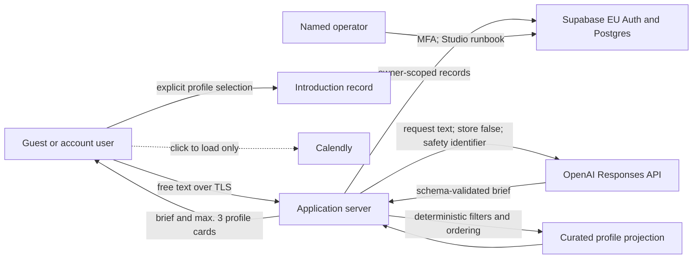

# Product Boundary & Data Flow — Freelancer V1

Status: implementation baseline. The client must approve this document and the
retention values before production launch. It is an engineering record, not a
substitute for legal advice.

## Purpose and actors

The application helps a business describe a project, structures only the facts
provided, searches curated freelancer profiles using deterministic rules, and
lets the business explicitly request an introduction.

- Customer: controls the project text and selects a displayed profile.
- Freelancer: has a curated public-safe profile; is never automatically hired.
- Operator: trusted internal user working in Supabase Studio.
- Application server: validates inputs, calls providers and performs privileged
  operations.
- OpenAI: converts customer text into the approved brief schema only.

## Data flow

Freelancer profiles are never included in OpenAI model requests. Matching and
ordering are reproducible without OpenAI. Calendly receives no chat or project
content from the application and is not requested until the user clicks.

## Data categories

| Record | Minimum data | Purpose |
|---|---|---|
| Auth user | Supabase ID, identity provider, optional email | Session and ownership |
| Project | Original request, structured brief, timestamps | User workspace and matching input |
| Message | Minimal user/assistant state | Reconstruct saved project |
| Profile | Public-safe professional facts and verification labels | Deterministic search |
| Match | Profile/version snapshot, reasons, gaps, rule version | Explain and reconstruct results |
| Introduction | Explicit selection and workflow status | Human follow-up |
| Engagement | Operator-confirmed lifecycle and optional contract value | Post-introduction status |
| Audit | Actor pseudonym/reference, action, target, result, trace ID | Security and accountability |
| AI usage | Pseudonymous subject/IP HMAC and token counters | Abuse and provider cost control |

The chat is free text and may contain unnecessary personal or confidential
information. The UI warns users not to submit special-category or third-party
data unless necessary and authorized. Logs never contain chat bodies, tokens,
secrets or raw IP addresses.

## Decisions and exclusions

- No payment, credit, escrow or invoice data in V1.
- No automated hiring decision or hidden suitability score.
- Missing budget, location, availability, qualification and contractual facts
  remain `null`/unknown.
- Anonymous users receive an authenticated Supabase identity; raw IP addresses
  are a secondary abuse signal, never ownership identity.
- Existing-account login uses a one-time, expiring, server-verified guest claim.
- Deletion removes user-owned content and retains only the approved
  pseudonymized audit minimum.

## Retention baseline

`public.retention_policies` is the single configuration source. The seed values
below are provisional launch defaults and must be approved by the controller;
there are no duplicate environment-variable overrides.

| Record type | Default | End-of-period action |
|---|---:|---|
| Anonymous Auth users | 30 days after abandonment | Delete after confirming no active workspace/claim |
| Guest claims | Claim expires after 30 minutes; record retained up to 30 days | Delete consumed/expired record |
| Messages | 180 days | Delete |
| Inactive projects | 365 days | Operator review before deletion |
| Shortlists and match snapshots | 365 days | Delete |
| Introduction records | 730 days | Operator review before deletion |
| Engagements | 2,555 days | Operator/legal review before deletion |
| Audit events | 730 days | Pseudonymize on account deletion; then delete after approved period |
| AI usage buckets and settled reservations | 90 days | Delete after reconciliation |
| Unsettled AI reservations | Review after 1 day | Reconcile first; never silently release |
| Paused/archived profiles | Contract-dependent | Operator review |

V1 ships self-service account deletion plus a daily Supabase Cron cleanup for
approved hard-delete periods. Operator-review rows are never deleted
automatically. The controller must sign off the seeded values before launch and
the named operator verifies execution monthly.
